# Alphabot Build Instructions

First of all, the Alphabot repository is needed. This can be cloned from GitHub with with the following command:

```console
git clone --recursive https://github.com/Filiprogrammer/AlphabotSZUCar.git
```

The ```--recursive``` option ensures that all submodules are cloned as well.

## Parts list

|                     Part                     |   Amount    |
|----------------------------------------------|-------------|
| TT DC Gearbox Motor                          |      2x     |
| DIN 912 M3x10 screw                          |      9x     |
| 28BYJ-48 stepper motor                       |      2x     |
| DIN 912 M3x5 screw                           |      2x     |
| Ball bearing 10x15x4                         |      4x     |
| Ball bearing 5x11x4                          |      4x     |
| Ball bearing 5x8x2.5                         |      2x     |
| DIN 912 M3x14 screw                          |      4x     |
| TF-Luna LiDAR sensor                         |      1x     |
| M2x6 screw                                   |     10x     |
| 3S 18650 battery holder case box (7.6x6x2cm) |      1x     |
| M2.5x5 screw                                 |      2x     |
| 18650 Lithium-Ion Battery 3.7V               |      3x     |
| DIN 912 M3x8 screw                           |      2x     |
| DIN 912 M3x6 screw                           |      2x     |
| L298N DC motor driver module                 |      1x     |
| M2 screw                                     |      4x     |
| M2 male-female hex spacer                    |      4x     |
| M2 nut                                       |      8x     |
| M2.5 screw                                   |      5x     |
| M2.5 male-female hex spacer                  |      4x     |
| ESP-WROOM-32 board                           |      1x     |
| Arduino Pro Mini 16MHz 5V                    |      4x     |
| USB to TTL adapter (e.g. FT232RL)            |      1x     |
| 15mm*21mm 2 pins rocker switch               |      1x     |
| CZM5/2 terminal block                        |      1x     |
| 2.54mm female 12 pin header                  |      8x     |
| 2.54mm female 19 pin header                  |      2x     |
| 2.54mm any 6 pin header                      |      3x     |
| 2.54mm any 4 pin header                      |      1x     |
| S5B-XH-A connector header                    |      2x     |
| DIN 912 M3x5 screw                           |      6x     |
| wire                                         |     16x     |
| FC-03 infrared sensor                        |      1x     |

## Custom PCBs to produce

|          PCB           | Amount |
|------------------------|--------|
| pcb/dwm1000_adapter    |   4x   |
| pcb/alphabot_esp32_pcb |   1x   |

## Parts to 3D print

|                            Part                         | Amount | Material |
|---------------------------------------------------------|--------|----------|
| stl/dwm1000.anchor.adapter.board.mount.stl              |   3x   |   PLA    |
| stl/vehicle/base/alphabot.4Wheel.base.Top.esp32.stl     |   1x   |   PLA    |
| stl/vehicle/base/alphabot.4Wheel.base.suspension.V6.stl |   1x   |   PLA    |
| stl/vehicle/base/frontwheel.suspension.distance.stl     |   3x   |   PLA    |
| stl/vehicle/steering/steering.axle.stl                  |   1x   |   PLA    |
| stl/vehicle/steering/steering.stepper.pin.stl           |   1x   |   PLA    |
| stl/vehicle/steering/suspension.left.V4.stl             |   1x   |   PLA    |
| stl/vehicle/steering/suspension.right.V4.stl            |   1x   |   PLA    |
| stl/vehicle/wheel/rim.front.62mm.V2.stl                 |   2x   |   PLA    |
| stl/vehicle/wheel/rim.back.62mm.V2.stl                  |   2x   |   PLA    |
| stl/vehicle/wheel/rim.62mm.front.bearing.cage.V2.stl    |   2x   |   PLA    |
| stl/vehicle/wheel/rim.62mm.back.bearing.cage.V2.stl     |   2x   |   PLA    |
| stl/vehicle/wheel/rim.62mm.front.nut.stl                |   4x   |   PLA    |
| stl/vehicle/wheel/tire.base.62.78.stl                   |   4x   | Filaflex |
| stl/vehicle/wheel/rim.axle.back.stl                     |   2x   |   PLA    |
| stl/vehicle/addon/wingv4.stl                            |   1x   |   PLA    |
| stl/vehicle/addon/wing.holder.V4.hc-sr04.stl            |   1x   |   PLA    |
| stl/vehicle/addon/dwm1000.tag.adapter.board.mount.stl   |   1x   |   PLA    |
| stl/vehicle/addon/bumper.lidar.holder.stl               |   1x   |   PLA    |
| stl/vehicle/addon/bumper.lidar.front.stl                |   1x   |   PLA    |
| stl/vehicle/addon/wheel.encoder.stl                     |   1x   |   PLA    |

## Positioning module

### Assembly

After ordering the DWM1000 adapter PCB with assembly service, the board should look like this:


Now solder pin headers for the Arduino Pro Mini to the board as seen in the following picture.


Finally plug the Arduino Pro Mini into the DWM1000 Adapter.


### Software

The software for the microcontrollers can be built with PlatformIO. PlatformIO is a useful tool for development for various embedded systems. This tool can be used either standalone or as an extension in Visual Studio Code. The process with this Visual Studio Code extension is explained below.

To install the extension, click on the Extensions tab in Visual Studio Code and search for PlatformIO.


Click "Install" to install the extension. Restart Visual Studio Code once the installation has completed.

For the positioning system, the Arduino Pro Mini, which acts as a "tag" on the Alphabot, must be flashed with the appropriate firmware. Open the positioning_tag folder of the Alphabot repository in VSCode. The Arduino Pro Mini has to be connected to the computer with a USB to TTL adapter like the FT232RL.


The firmware can be uploaded to the Arduino Pro Mini by clicking the upload button in VSCode.


Now the firmware is built and uploaded to the Arduino Pro Mini via the adapter. Once this process completes, check whether it worked by taking a look at the Serial Monitor.

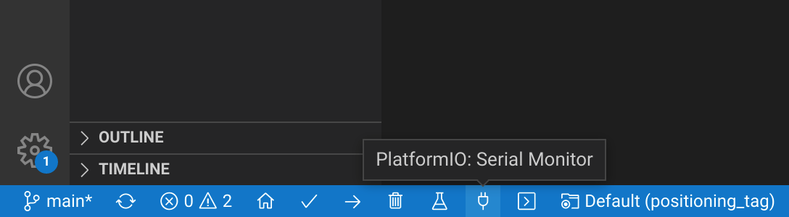

If the process was successful, the following message will appear in the Serial Monitor:


Next, the anchors can be set up. Plug an Arduino Pro Mini that is to be used as an anchor into the adapter. Open the folder positioning_anchor of the Alphabot repository in VSCode.

Now go to line 27 of positioning_anchor/DWM1000_Anchor/DWM1000_Anchor.ino.


Each anchor should have its own address. The addresses from the comments on lines 24 to 26 are to be used when uploading. For clarity, it is helpful to label the positioning modules accordingly.


Once the firmware is uploaded, the serial monitor should display the following message with the corresponding address:

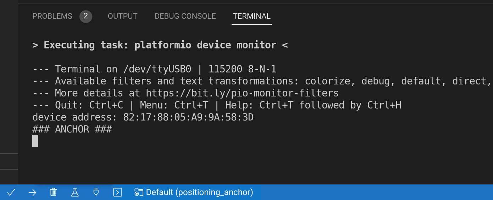

Upload the firmware to the other two anchors as well. Always make sure that the correct address is entered on line 27 before uploading.

If everything went well, all anchors will connect to the tag when the positioning modules are connected to the power. Each Arduino Pro Mini should write the measured distances to the serial interface.

### Attaching an anchor to a holder

Insert a positioning module configured as an anchor into an anchor holder (stl/dwm1000.anchor.adapter.board.mount.stl)


Screw the positioning module on with two M2x6 screws and two M2 nuts.

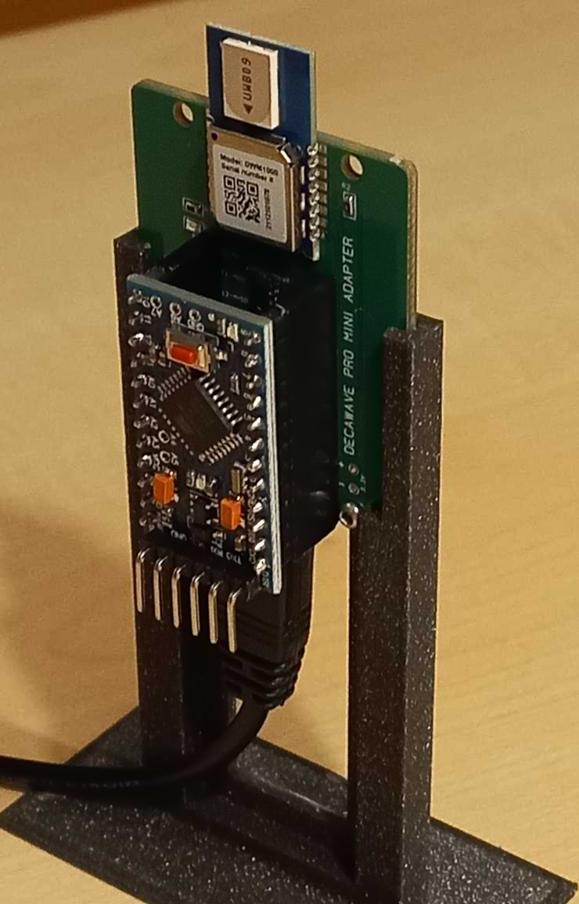

Repeat this process for the other two anchors.

## Alphabot ESP32 PCB assembly

After ordering the Alphabot ESP32 PCB with assembly service, the board should look like this:


Now solder the pin headers for the ESP-WROOM-32, for the L298N motor driver, for the positioning module and for the TF-Luna LiDAR sensor to the board.

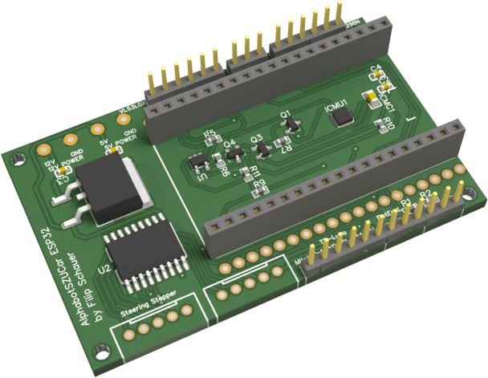

Also solder two S5B-XH-A connector headers for the stepper motors to the board as seen in the following picture.


Solder a CZM5/2 terminal block to the 12V power pins of the board.


Finally you can plug the ESP-WROOM-32 into the Alphabot ESP32 PCB.


## Alphabot car assembly

Start with soldering the gear motors. Both contacts of the motor are to be soldered to a separate wire.


Once the gear motors are soldered, insert them on the bottom of the base plate (stl/vehicle/base/alphabot.4Wheel.base.Top.esp32.stl) of the Alphabot.


Now take the wheel encoder (stl/vehicle/addon/wheel.encoder.stl) and put it onto the hub of the motor as seen in the pictures below.

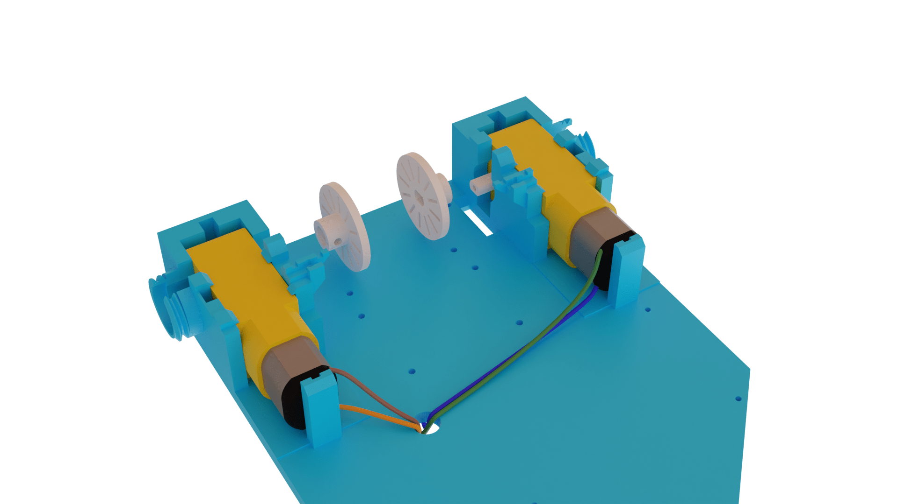

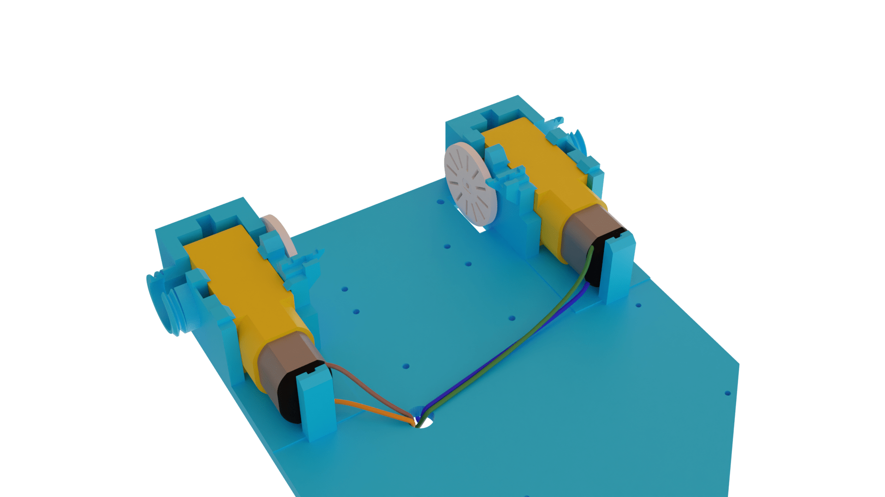

Next, pull a tire (stl/vehicle/wheel/tire.base.62.78.stl) onto a rear wheel. (stl/vehicle/wheel/rim.back.62mm.V2.stl)


This results in a ready rear wheel.


Attach a rear wheel to the gear motor on each side.


When mounting the rear wheel, first attach the axle (stl/vehicle/wheel/rim.axle.back.stl) to the motor hub.


For a stable position of the wheel axle, slide a 10x15x4 ball bearing around the wheel axle, so that the motor can still easily turn the wheel.


To prevent the ball bearing from falling out, screw a wheel axle cover (stl/vehicle/wheel/rim.62mm.back.bearing.cage.V2.stl) onto it.


Attach the rear wheel to the axle.


Screw the wheel to the axle with a wheel nut (stl/vehicle/wheel/rim.62mm.front.nut.stl) and a DIN 912 M3x14 screw so that the wheel is securely mounted on the axle.


Once both rear wheels are attached it should look like this:

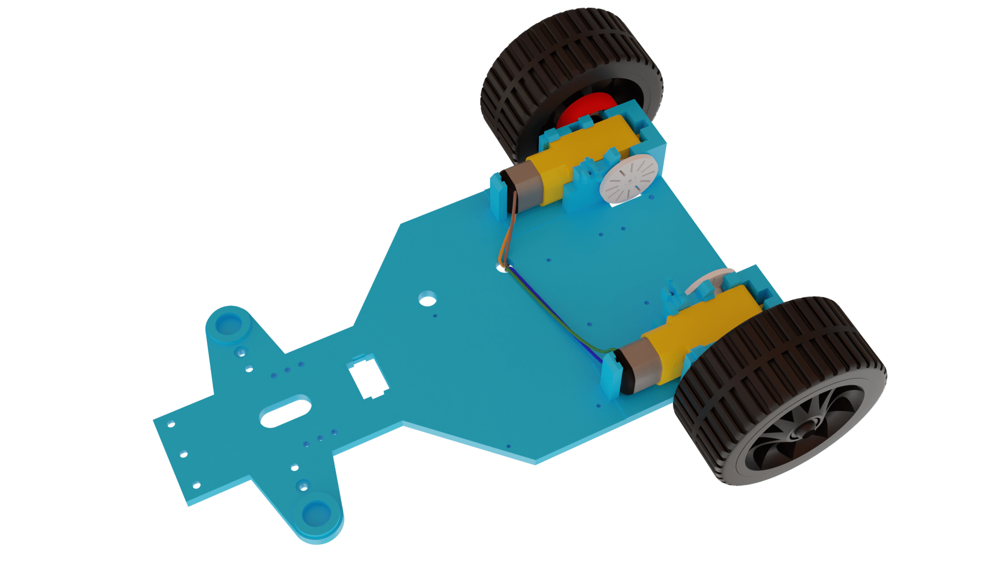

Next, the base plate with the motors can be put aside for the time being. Screw three spacers (stl/vehicle/base/frontwheel.suspension.distance.stl) to the steering bracket (stl/vehicle/base/alphabot.4Wheel.base.suspension.V6.stl) using three DIN 912 M3x10 screws.


Now screw a 28BYJ-48 stepper motor to the front bumper (stl/vehicle/addon/bumper.lidar.front.stl) using two DIN 912 M3x10 screws.


Attach the LiDAR holder (stl/vehicle/addon/bumper.lidar.holder.stl) to the hub of the stepper motor.


In the next step, screw the steering bracket to the front bumper. Use four DIN 912 M3x5 screws for this.


In the next step, return to the base plate. Attach a stepper motor for steering to the base plate using two DIN 912 M3x5 screws.

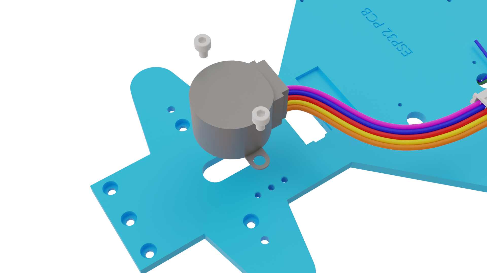

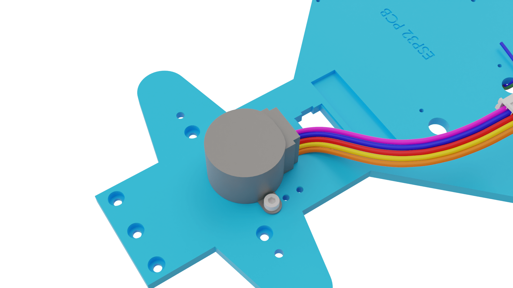

Once the stepper motor has been screwed to the base plate, the steering extension (stl/vehicle/steering/steering.stepper.pin.stl) can be attached to the the stepper motor hub protruding from the bottom of the base plate.

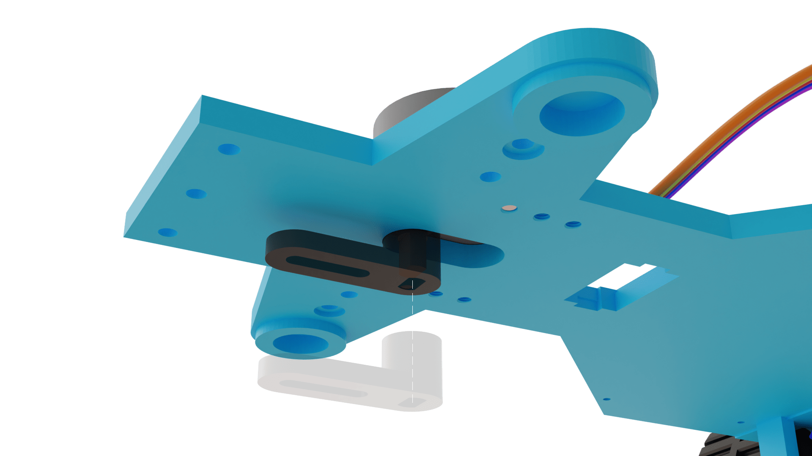

Now insert the two 5x8x2.5 ball bearings on the steering axle (stl/vehicle/steering/steering.axle.stl).


Attach the steering axle to the steering extension with a DIN 912 M3x10 screw. Insert 5x11x4 ball bearings in the provided recesses and place the steering suspensions (stl/vehicle/steering/suspension.left.V4.stl & stl/vehicle/steering/suspension.right.V4.stl) on top.


Attach 5x11x4 ball bearings to the underside of the steering axles.


Now the two large parts can be screwed together. Screw the spacers to the base plate using three DIN 912 M3x10 screws. The ball bearings should fit into the provided recesses.


The next step is to mount the front wheels.


First slide the front bearing cage (stl/vehicle/wheel/rim.62mm.front.bearing.cage.V2.stl) containing a 10x15x4 ball bearing onto the front wheel axle.


Slide the front wheel (stl/vehicle/wheel/rim.front.62mm.V2.stl & stl/vehicle/wheel/tire.base.62.78.stl) onto the axle and screw the bearing cage onto the inside of the wheel.

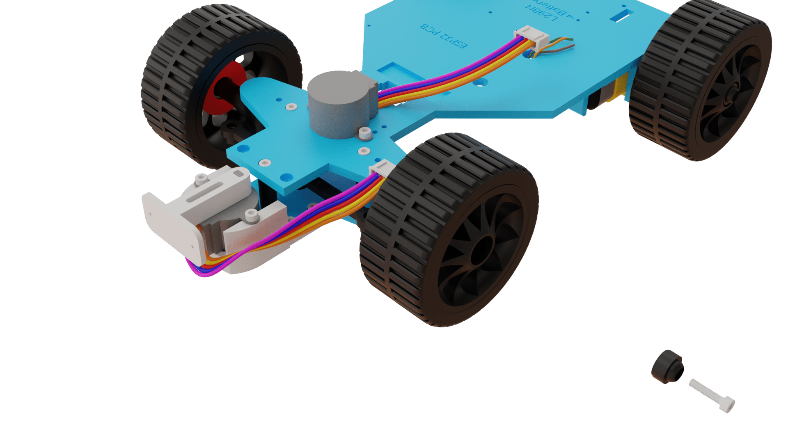

Then screw the wheel to the axle with a wheel nut (stl/vehicle/wheel/rim.62mm.front.nut.stl) and a DIN 912 M3x14 screw so that it does not come loose while driving.


For obstacle detection, screw the TF-Luna LiDAR sensor to the dedicated holder at the front. Use M2x6 screws for that.


Insert a 15mm*21mm 2 pins rocker switch through the base plate at the designated location.

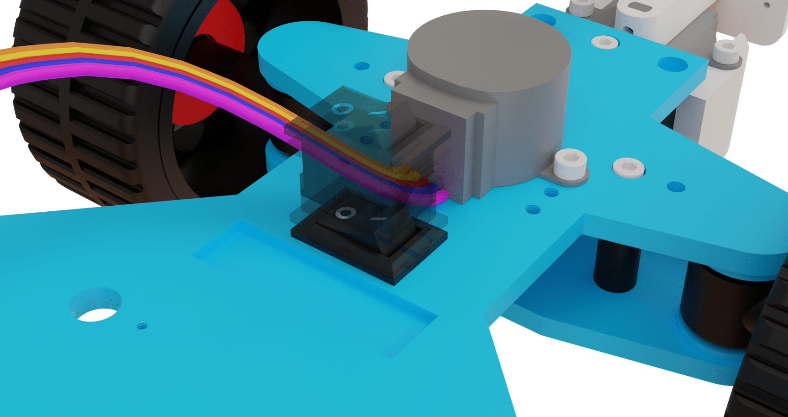

The battery case can be screwed to the underside of the base plate with two M2.5x5mm screws. Furthermore, interrupt a power line from the battery case with the rocker switch.

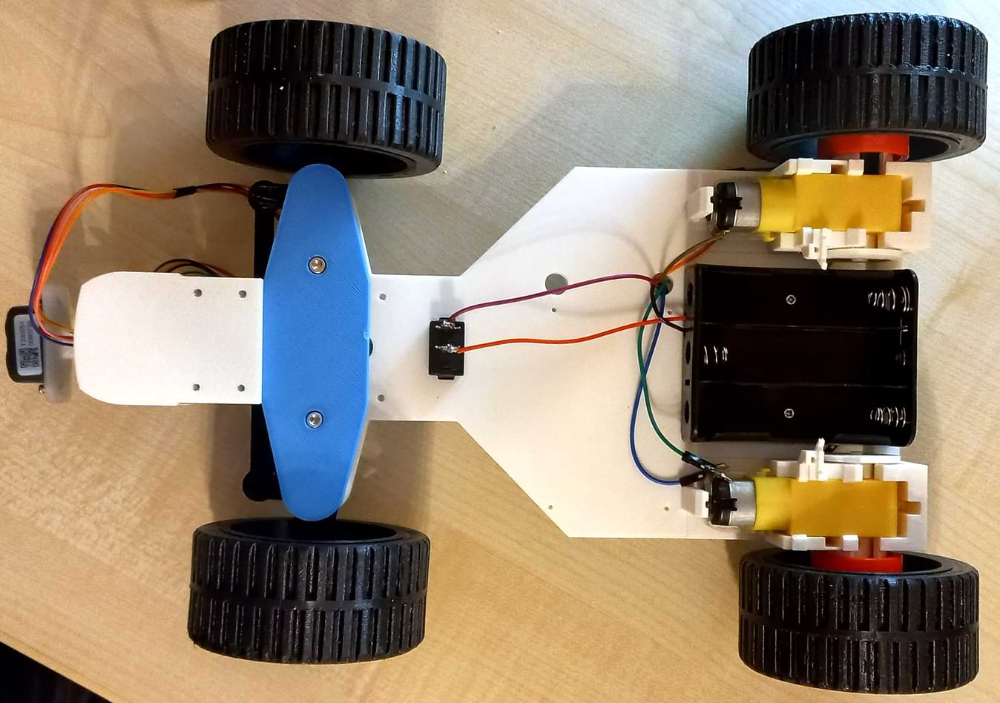

Mount the FC-03 infrared sensor around the encoder wheel with an M2.5 screw.

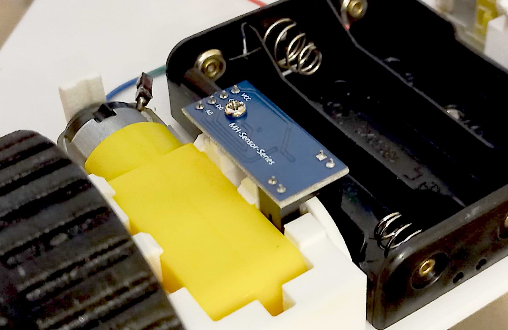

Screw four M2 hex spacers into the screw holes provided for the Alphabot ESP32 PCB and screw four M2.5 hex spacers into the screw holes provided for the L298N.


Up next, mount the rear spoiler to the rear of the base plate. Mount the wing holder (stl/vehicle/addon/wing.holder.V4.hc-sr04.stl) to the base plate with two DIN 912 M3x8 screws and mount the wing (stl/vehicle/addon/wingv4.stl) to the wing holder with two DIN 912 M3x6 screws.

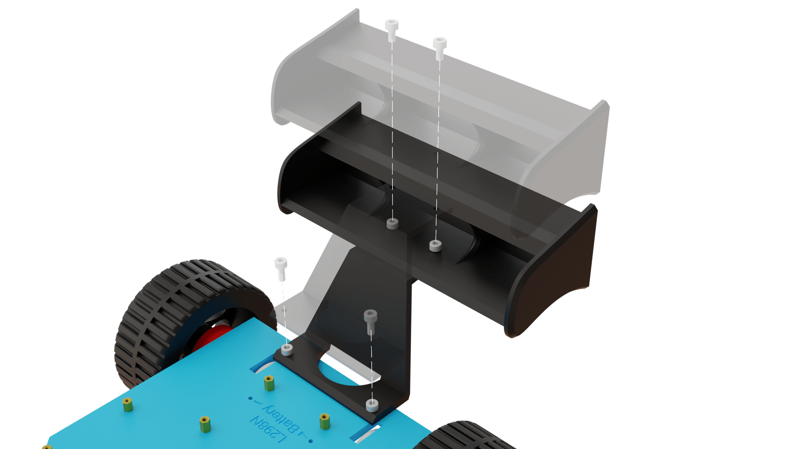

For the positioning module, glue the holder for the tag (stl/vehicle/addon/dwm1000.tag.adapter.board.mount.stl) to the base plate.

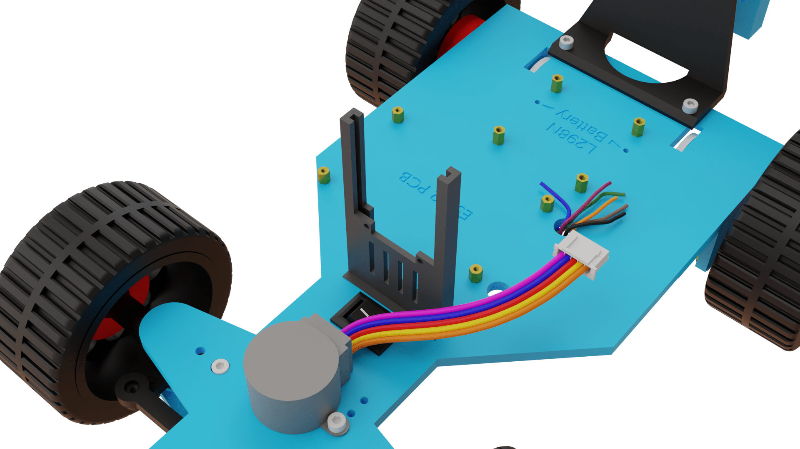

Screw the L298N motor driver to the base plate with M2.5 screws and connect it to the drive motors and the power supply.


Now the heart of this Alphabot comes into play: the Alphabot ESP32 PCB. Attach the Alphabot ESP32 PCB with the ESP-WROOM-32 plugged in to the base plate using M2 male-female hex spacers and M2 screws.

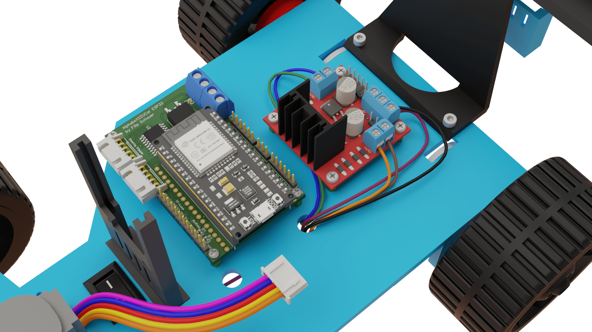

Connect the Alphabot ESP32 PCB to the power supply through its 12V power connectors.


Connect the pins of the L298N motor driver to the Alphabot ESP32 PCB.


Now insert the positioning module configured as a tag into the DWM1000 tag holder.


Connect the GND, VCC and TXO pins on the Arduino Pro Mini of the positioning module to the Alphabot ESP32 PCB.

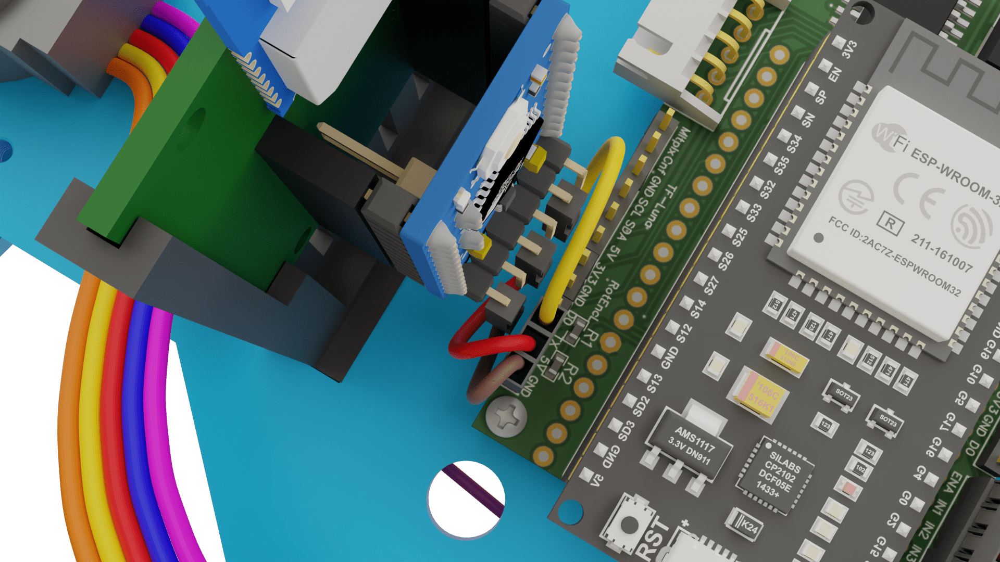

Screw the positioning module on with two M2x6 screws and two M2 nuts.


Connect the steering stepper motor to the correspondingly labeled B5B-XH-AM connector header on the Alphabot ESP32 PCB.


Connect the stepper motor at the front to the other B5B-XH-AM connector header on the Alphabot ESP32 PCB.

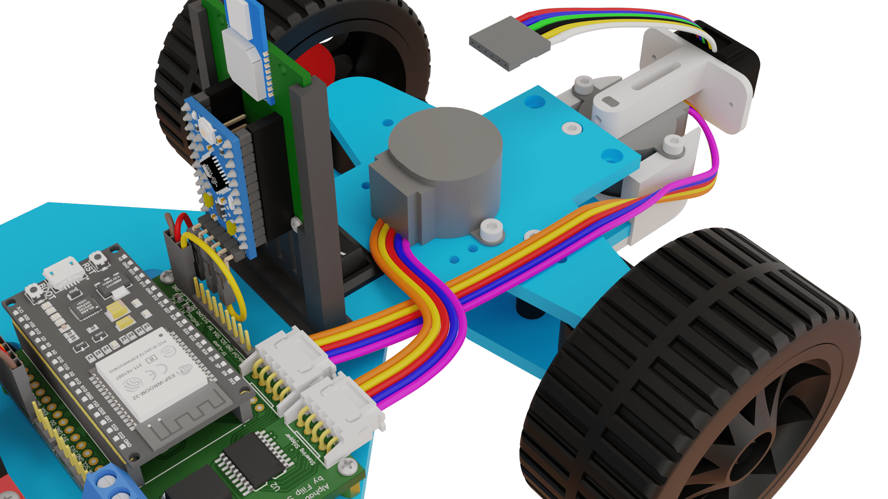

Connect the TF-Luna LiDAR sensor at the front to the Alphabot ESP32 PCB.


Now that the Alphabot is successfully assembled, the software part can begin.


## ESP32 Software

Open the directory esp32/PrimaryESP32 in VSCode. Make sure that the Alphabot's power is turned off and connect the ESP32 to the computer. The firmware can be uploaded to the ESP32 by clicking the Upload button in VSCode.

Alternatively this can also be done via the command line:

```console
pio run --target upload
```

If the upload process was successful, the ESP32 will now execute the uploaded code. The ESP32 can be unplugged from the computer and be used in real operation.
