# Alphabot Usage

Once the Alphabot has been built and the Android client deployed to a mobile device, a number of use cases open up.

## Connecting the client to the Alphabot

Turn the Alphabot on by flipping the switch on the vehicle into the 1 state. Now the front wheels and the front sensor should start calibrating.

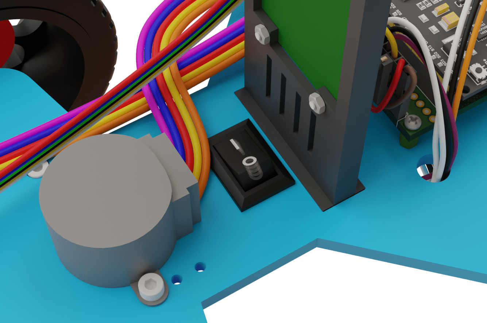

Start the android client and type the BLE MAC address of the ESP32 on the Alphabot into the text box and then press the connect button. After one or two seconds the control activity should open up.

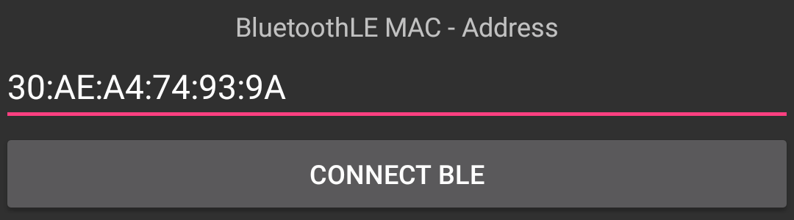

## Explaining the basic controls

What should be immediately apparent, is that tilting the phone steers the front wheels of the car.

Disabling collision avoidance grants the user unrestricted control over the movement of the vehicle. Holding down the "Accelerate" button makes the vehicle accelerate forwards. The longer that button is held down, the faster the vehicle gets. Upon releasing the button the vehicle starts slowing down. To maintain a slow speed forwards, the "Accelerate" button has to be pushed and released in regular intervals. If the user wishes to stop the car abruptly, they can do so by briefly pressing the "Brake" button. The "Brake" button can also be used the same way as the "Accelerate" button to drive backwards. The "Accelerate" button also stops a vehicle that is driving backwards. The desired speed is shown as a progress bar above the two buttons.

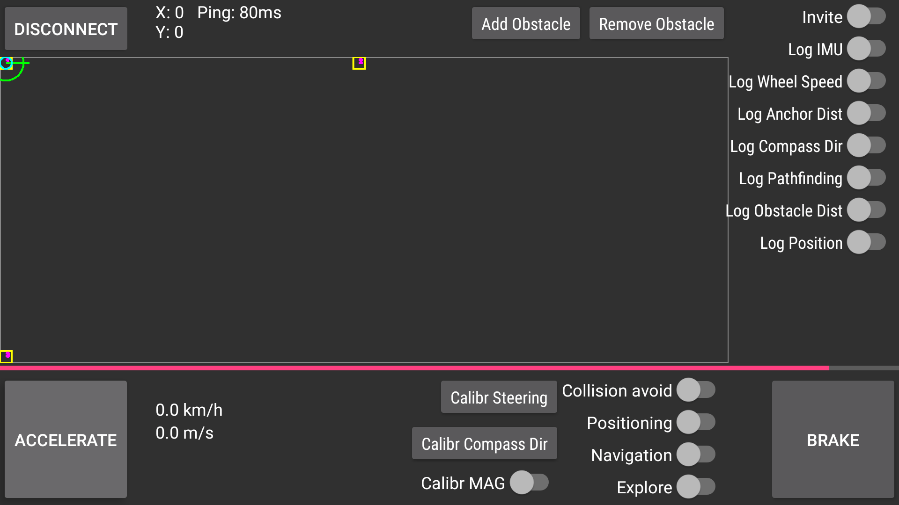

Enabling the "Log wheel speed" switch displays the mean wheel speed to the right of the "Accelerate" button. The actual speed of the rear wheels is also indicated by two progress bars just above the magenta progress bar. The faster the wheels get, the more the bars fill towards the center of the screen. The left bar represents the left rear wheel and the right bar represents the right rear wheel.

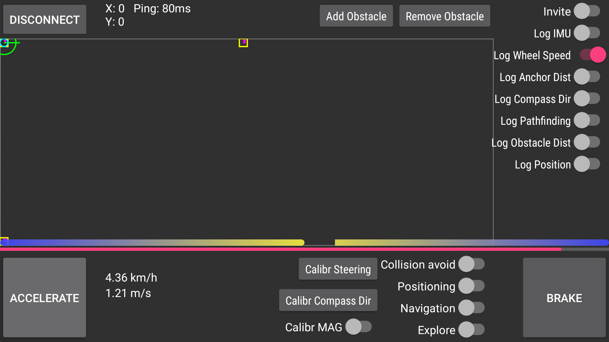

## Using the compass to determine the direction of the vehicle

Enabling the "Log Compass Dir" switch makes the vehicle on the minimap face into the same direction as the Alphabot. Odds are, that the displayed direction is incorrect. To fix this, the magnetometer first needs to be calibrated. To do that, place the vehicle on a flat surface away from any magnetic interferences. Then enable the "Calibr MAG" switch. Now drive the vehicle in a circle a few times or simply rotate it by hand, making sure it always lies flat on the ground. Once that is done, disable the "Calibr MAG" switch. Now the measured direction should rotate proportionally to the rotation of the vehicle. However, the direction is probably offset by some number of degrees from the user's desired direction. Here the user should decide how to setup a positioning system and relative to that in which direction the vehicle should face.

## Setting up the positioning system

First the user should decide where to set up the positioning system and then place the anchors far apart from each other. It is important that the anchors do not all reside on one line.

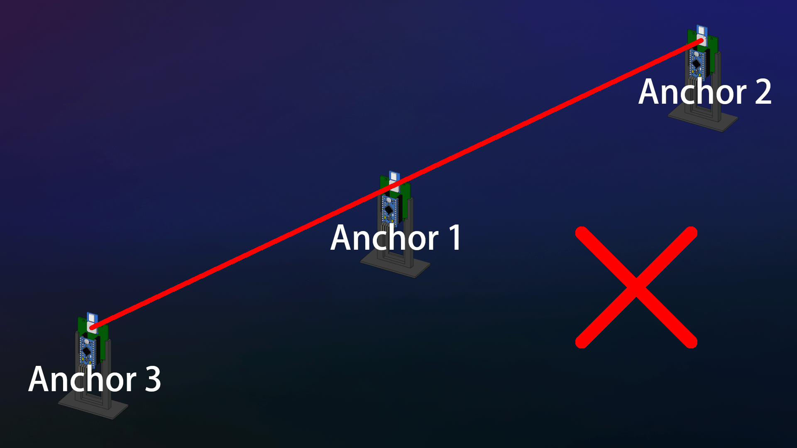

 A recommended way to place the anchors can be seen in the following picture:

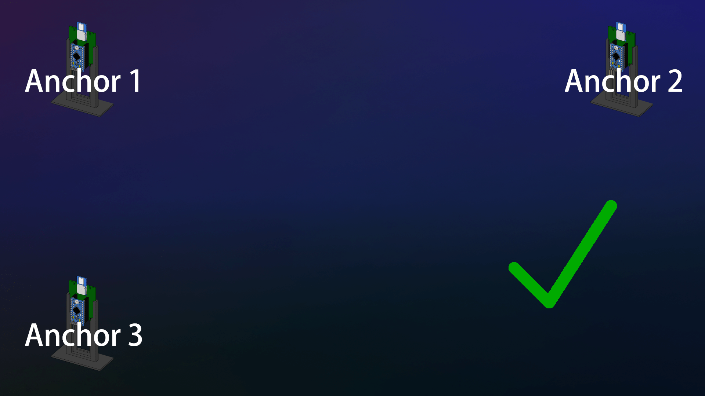

Once the user has decided where to place the anchors, it is important to ensure that the anchors remain in place without moving. In the next step the positions of the anchors should be measured. It is important that the measurements are as accurate as possible. This should result in every anchor having its own coordinates.

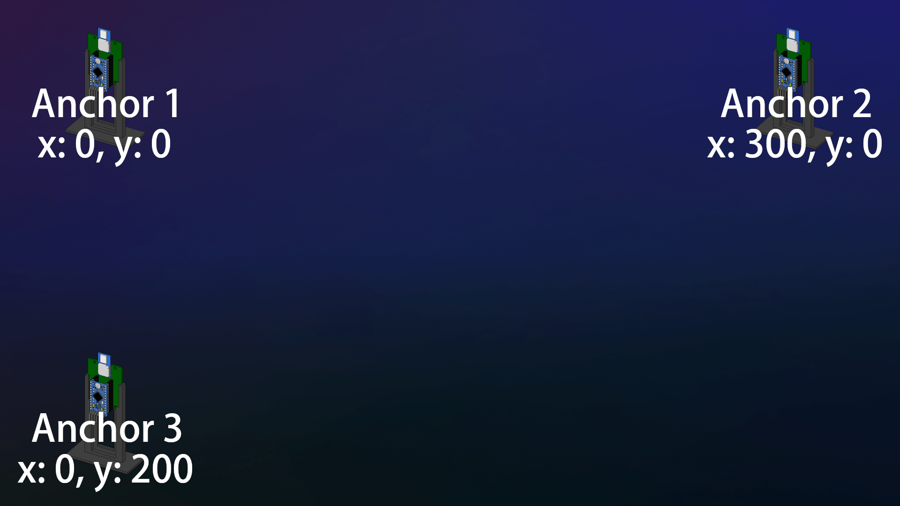

Now power on the positioning anchors, turn on the Alphabot and connect to it. Once connected enable the "Positioning" switch. A dialog should appear asking for the anchor coordinates.

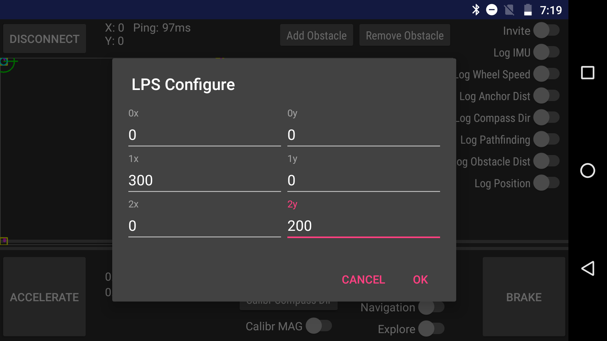

Enter the anchor coordinates and press "OK". This enables the positioning system. Enable the "Log Position" switch to see the estimated position. The coordinates of the vehicle are displayed next to the "Disconnect" button and it is also visually represented on the map in the middle of the screen.

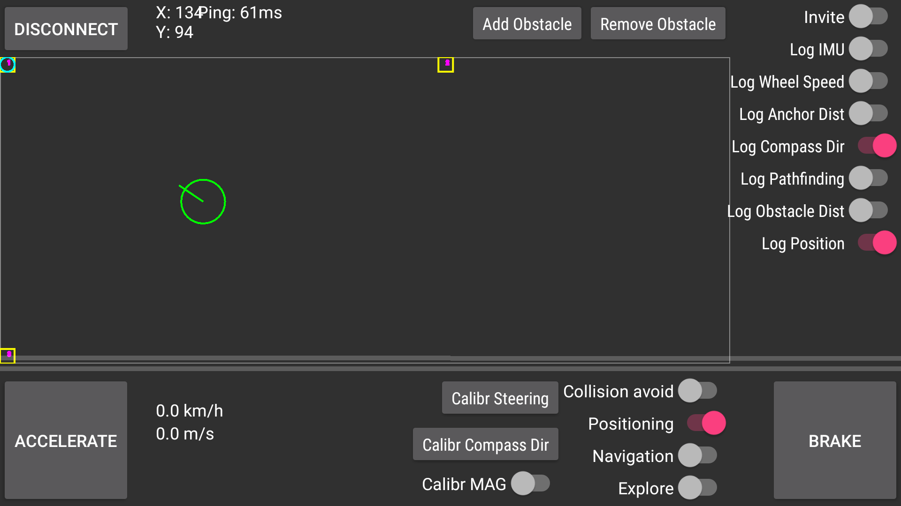

To make the compass point in the correct direction, first make sure that "Log Compass Dir" is enabled. Then place the vehicle anywhere on the map facing the first anchor. Make sure that it is pointing as accurately as possible in the direction of the first anchor. Wait a few seconds to ensure that the estimated position is as close to the truth as possible. Then press the "Calibr Compass Dir" button. The measured direction should now match the truth.

With the compass properly calibrated, the positioning system should now work very accurately while driving around.

## Navigation

By enabling the "Navigation" switch, the Alphabot is put into navigation mode. The user can no longer directly control the vehicle. Instead the user can click anywhere on the map and the Alphabot is going to try to drive toward that location. To see the path that the Alphabot is trying to take, enable the "Log Pathfinding" switch.

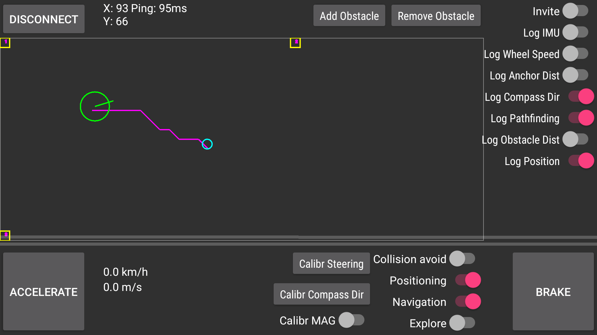

## Obstacles

In case there are any obstacles that the vehicle should avoid, those can be added manually via the "Add Obstacle" button. Pressing the button opens a dialog where the user can enter the position and size of the obstacle.

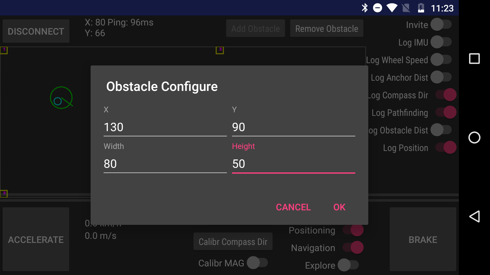

Pressing "OK" adds the obstacle to the map.

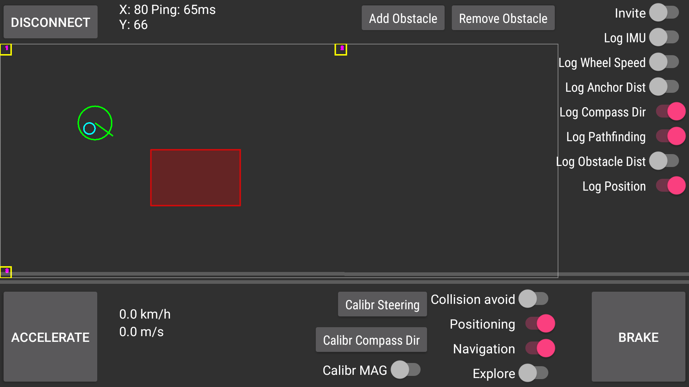

To remove an obstacle, simply select it by tapping on it. The selected obstacle should turn green. Then press the "Remove Obstacle" button.

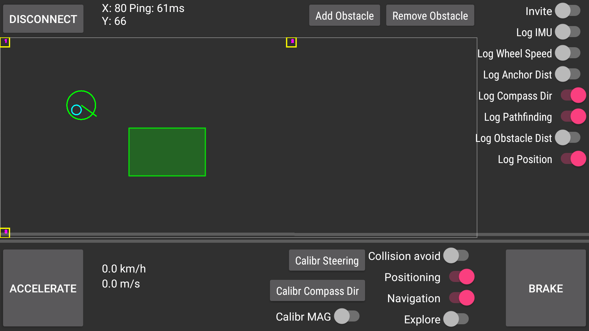

## Obstacle detection

Enabling the "Log Obstacle Dist" switch makes the Alphabot start scanning its surroundings for obstacles, if this is not already enabled by the "Collision avoid" or "Explore" switches. The measured obstacle distances are represented visually on the map.

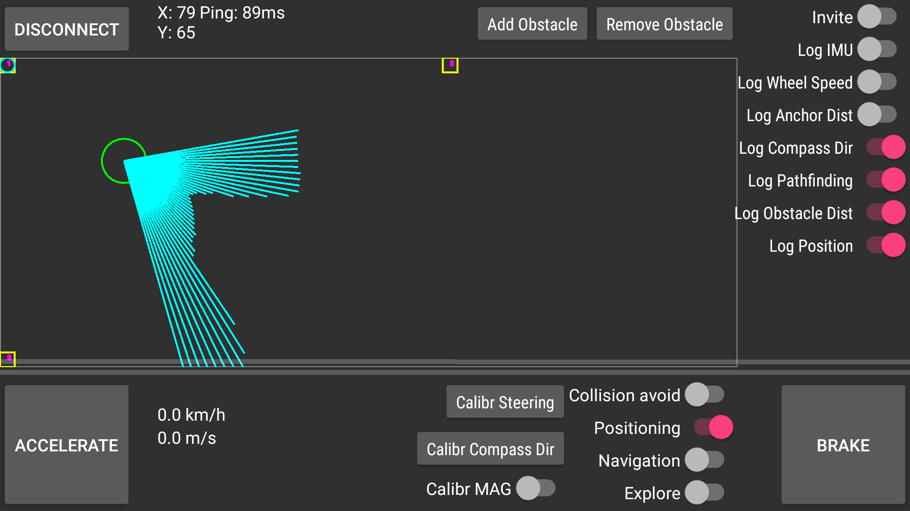

## Invite

Enabling the "Invite" switch allows another client to connect to the Alphabot. This way multiple clients can be connected to the Alphabot simultaneously. As soon as another client connects, the "Invite" switch automatically turns off again.
